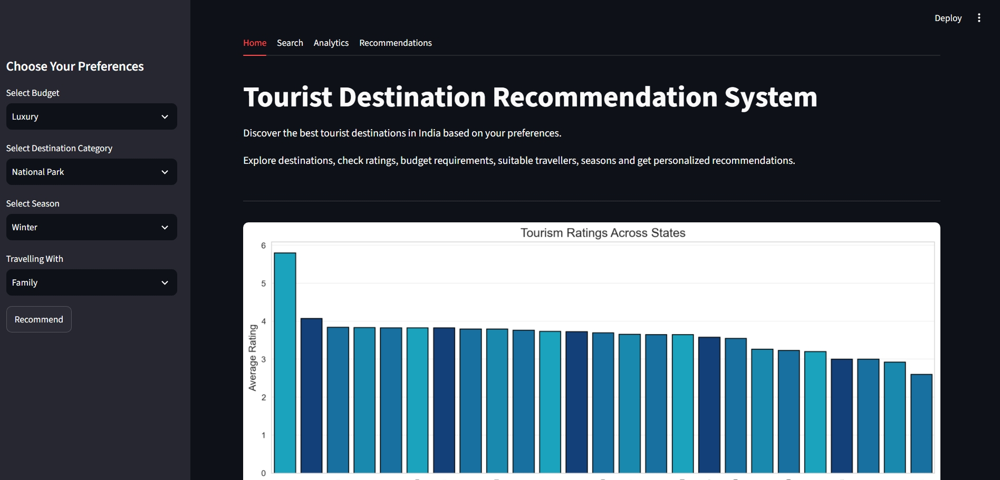

# Tourist Destination Recommendation System

## Project Description

The Tourist Destination Recommendation System is a data science project developed to help users discover suitable tourist destinations across India based on their travel preferences.

The application analyzes tourism-related attributes such as budget, destination category, best travel season, traveller type, and destination ratings to recommend suitable tourist destinations. It also provides an interactive Streamlit web application where users can search for destinations, explore destination details, and receive personalized travel recommendations through an intuitive interface.

---

## Problem Statement

Planning a trip often requires searching multiple websites to compare destinations based on budget, travel season, destination type, and traveller preferences. This process can be time-consuming and confusing.

The objective of this project is to simplify travel planning by:

- Recommending tourist destinations based on user preferences.
- Displaying detailed information about tourist destinations.
- Helping users make informed travel decisions using data analytics.
- Providing an interactive and user-friendly web application.

---

## Features

### Destination Search

- Search any tourist destination by name.
- View complete destination information instantly.

### Personalized Recommendation

Recommend destinations based on:

- Budget Category
- Destination Category
- Best Travel Season
- Traveller Type

### Interactive Data Analytics

The application provides visual analytics including:

- State-wise Average Tourism Rating
- Recommended Months Distribution

### Destination Information

Displays the following details for the selected destination:

- Destination Name
- State
- Rating
- Budget Category
- Budget Per Person
- Category
- Best Season
- Suitable For
- Adventure Level
- Food Cost Per Day
- Shopping Score

### Streamlit Dashboard

- Interactive user interface
- Destination search functionality
- Personalized recommendation system
- Visual analytics dashboard

---

## Dataset

The project uses a custom Indian Tourism Dataset containing approximately **1000 tourist destinations** across India.

### Dataset Features

- Destination Name
- State
- City
- Category
- Budget Category
- Budget Per Person (INR)
- Rating
- Best Season
- Suitable For
- Adventure Level
- Popularity
- Food Cost Per Day (INR)
- Shopping Score
- Accessibility
- Ideal Duration
- Latitude
- Longitude
- Description

The dataset was cleaned, preprocessed, and feature engineered before building the recommendation system.

---

## Technologies Used

### Programming Language

- Python

### Libraries

- Pandas
- NumPy
- Matplotlib
- Scikit-learn
- Streamlit

### Development Tools

- Jupyter Notebook
- Visual Studio Code
- Git
- GitHub

---

## Project Workflow

```text
Dataset Collection
        │
        ▼
Data Cleaning
        │
        ▼
Exploratory Data Analysis (EDA)
        │
        ▼
Feature Engineering
        │
        ▼
Data Visualization
        │
        ▼
Preference-Based Recommendation System
        │
        ▼
Streamlit Web Application
        │
        ▼
Tourist Destination Recommendation
```

---

## Recommendation System

The project implements a **preference-based recommendation system** that recommends tourist destinations according to user selections.

### Recommendation Process

1. Dataset Collection
2. Data Cleaning and Preprocessing
3. Feature Engineering
4. Exploratory Data Analysis
5. User Preference Filtering
6. Ranking Destinations by Rating
7. Displaying Top Recommended Destinations

### Recommendation Parameters

The recommendation considers:

- Budget Category
- Destination Category
- Best Season
- Traveller Type

The system returns the highest-rated destinations that match the selected user preferences.

---

## Screenshots

### Home Page



---

### Destination Search


---

### Recommendation Results


---

### Analytics Dashboard


---

## Installation

Clone the repository:

```
git clone https://github.com/your-username/Tourist-Destination-Recommendation-System.git
```

Move to the project directory:

```
cd Tourist-Destination-Recommendation-System
```

Install the required libraries:

```
pip install -r requirements.txt
```

---

## How to Run

Run the Streamlit application:

```
streamlit run app.py
```

The application will automatically open in your default web browser.

---

## Project Structure

```text
Tourist-Destination-Recommendation-System/
│
├── app.py
├── README.md
├── requirements.txt
├── .gitignore
│
├── data/
│   └── Indian_Tourism_Dataset_1000.csv
│
├── notebooks/
│   └── Tourist_Recommendation_Destination_System.ipynb
│
└── images/
    ├── home.jpeg
    ├── destination_search.jpeg
    ├── recommendation.jpeg
    └── visual_analytics.jpeg
```

---

## Future Scope

Future enhancements for this project include:

- Integration with live tourism APIs.
- Hotel recommendation system.
- Flight booking integration.
- Weather forecasting.
- Nearby attractions recommendation.
- Restaurant recommendation.
- Destination image gallery.
- User authentication and user profiles.
- AI-powered travel chatbot.
- Trip itinerary generation.
- Mobile application deployment.

---

## Author

**Rajpreet Singh Sekhon**

B.Tech Computer Science and Engineering

Guru Nanak Dev Engineering College, Ludhiana

GitHub: https://github.com/rajpreetsinghsekhon

LinkedIn: www.linkedin.com/in/rajpreet-singh-37b216301

---

## License

This project is developed for educational and learning purposes.
